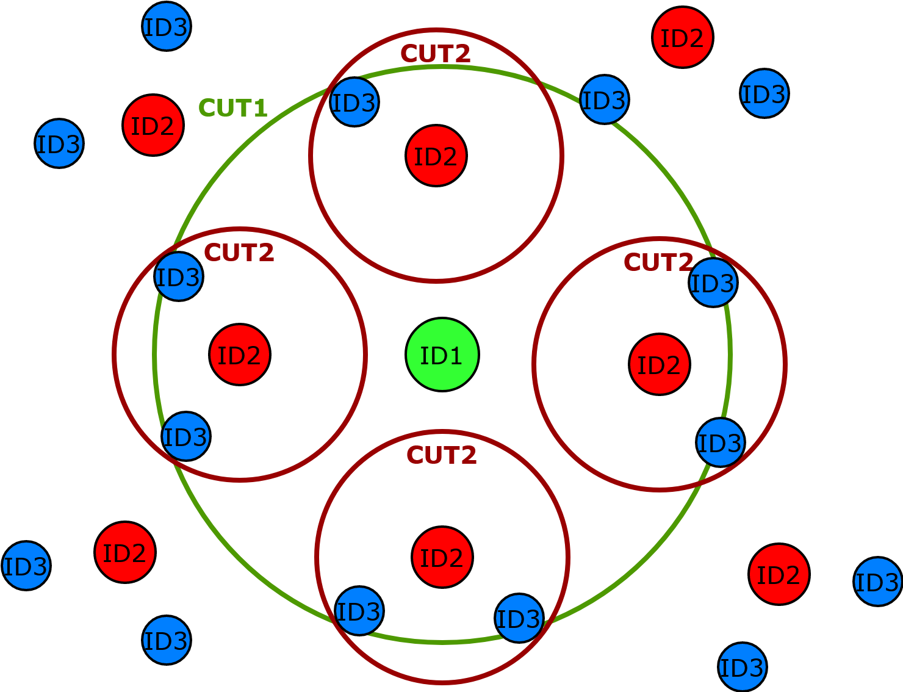
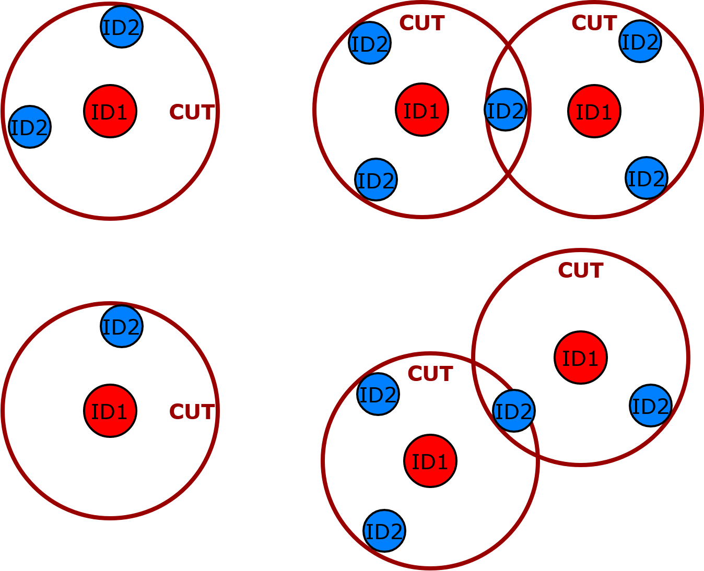
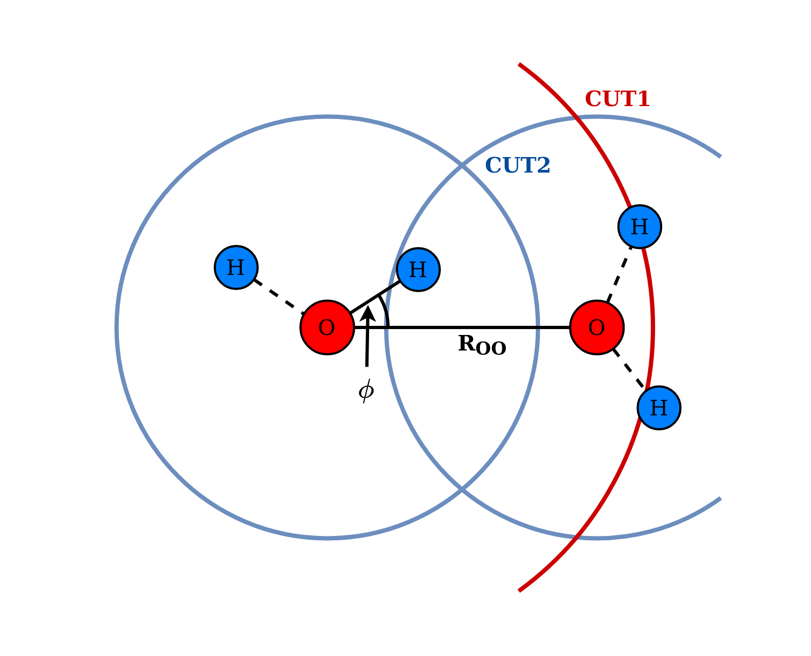

.. _Control:

Control file ".scntl"
=====================

The control file is responsible for what data is extracted and how it is processed.

.. contents::
    :local:

.. _Control_General:

General Structure
-----------------

A block has a given structure with an opening keyword, the different options contained within it and the closing keyword **!END**::

    !SCNTL
      !BLOCK_1
        ITEM_1 VALUE_1
        ITEM_2 VALUE_2
        ITEM_3_OFF VALUE_3
      !END
      !BLOCK_2_OFF
        ITEM_1 VALUE_1
        ITEM_2 VALUE_2
      !END
    !END
    
The control file is line sensitive and only searches for keywords in the first word of each line. Therefore an item can easily be removed by changing it or appending **\_OFF** to it. The same goes for whole blocks as shown for **!BLOCK\_2** but the closing keyword still needs to be present. Note that the `!SCNTL`_ block must suround all other blocks.
   
.. _Control_Example:
   
Example for the control file ".scntl"
-------------------------------------
Following example illustrates a few options of what is available for the user. This should not be taken as a good set of parameters but rather to see how to structure the file correctly. The file could be named *manganese.scntl*.

.. literalinclude:: Images/manganese.scntl

.. _Control_SCNTL:

!SCNTL
------
General control block.

Must include all other blocks.

:Rules: mandatory

.. glossary::
    ROOT
        specify project root name if different from control file
        
        WARNING: not fully tested
        
        :Type: str
        :Rules: optional
        :Default: root from control file
        
    PBC\_FOLDING
        fold atomic positions back into one unit cell to ensure sufficient periodic boundary conditions
        
        WARNING: only for cubic unit cells
        
        :Type: logical
        :Rules: optional, activate with TRUE
        :Default: FALSE

.. _Control_TRA:
        
!TRA
----

Trajectory extraction control block.

:Rules: optional

.. glossary::
    T1
        starting time for snapshot extraction
        using START flag selects first time available from simulation
        
        :Type: float, str: START
        :Rules: mandatory
        
    T2
        end time of snapshot extraction
        using END flag selects last time available from simulation
        
        :Type: float, str: END
        :Rules: mandatory
        
    N
        number of snapshots
        
        :Type: int 
        :Rules: mandatory

    SAVE
        save snapshots to :ref:`Output_snap` file
        
        :Type: logical 
        :Rules: optional, activate with TRUE
        :Default: FALSE
        
    LOAD
        load snapshots from :ref:`Output_snap` file; disables selection of **T1**, **T2** and **N**
        
        :Type: logical 
        :Rules: optional, activate with TRUE
        :Default: FALSE
        
.. _Control_ION:
        
!ION
----
Ion complex detection control block.

:Rules: optional, requires `!TRA`_

In the context of the paw\_structure package an "ion complex" is the terminology used to describe a selection of atoms found by an algorithm which is described below. The reader should be aware, that this is purely a geometric description and on itself holds no physical meaning outside of it. However, by choosing suitable parameters this can often coincide with the first solvation shell around an ion. 

Figure :ref:`Ion Complex<Control_ION_algorithm>` shows the search strategy for an ion complex. Firstly, the ion atom of type ID1 (e.g. Mn) is used as a center point. Then each atom of type ID2 (e.g. O) within a distance of less than a cutoff (CUT1) is identified. These atoms are then used as new centers from which atoms of type ID3 (e.g. H) closer than another cutoff (CUT2) are detected. Every atom found in this way is regarded as part of the ion complex by the program. Through a good choice of CUT1 and CUT2 based on the behavior of radial distribution functions the first solvation shell can be detected reliably depending on the system.

.. _Control_ION_algorithm:

    Ion complex detection algorithm with three different atom types (ID1, ID2, ID3) and two cutoff distances (CUT1, CUT2). Search starts with ID1 in the center and finding all ID2 within distance smaller than CUT1. Each of those ID2 found are used as new centers to find all ID3 within distance smaller than CUT2.

.. glossary::
    ID1
        identifier for atom used as center
        
        :Type: str
        :Rules: mandatory
    
    ID2
        identifier for atoms as possible first neighbors
        
        :Type: str
        :Rules: mandatory
    
    ID3
        identifier for atoms as possible neighbors of first neighbors
        
        :Type: str
        :Rules: mandatory
    
    CUT1
        cutoff distance for first neighbor search
        
        :Type: float
        :Rules: optional
        :Default: 3.0
    
    CUT2
        cutoff distance for second neighbor search
        
        :Type: float
        :Rules: optional
        :Default: 1.4

.. _Control_WATER:
        
!WATER
------
Water complex detection control block.

:Rules: optional, requires `!TRA`_

Similar to the "ion complex" being a term for a geometrical configuration, "water complex" is used in the paw\_structure context to describe all the formations of oxygen and hydrogen atoms that do not represent the typical molecular shape. The detection follows criteria which do not directly translate into physical relevance but enable the user to quickly identify relevant and interesting configurations. An illustration of these can be seen in figure :ref:`Water Complex<Control_WATER_algorithm>` which mostly rely on the number of hydrogen neighbors of each oxygen atom.

Note, that the cutoff distance should be chosen to include the hydrogen atoms of a H\ :sub:`2`\ O molecule but to exclude hydrogen atoms belonging to another molecule (H\ :sub:`2`\ O\ :math:`\cdots`\ H\ :sub:`2`\ O). Furthermore, the initial detection is not aware of ions and can therefore mark atoms that are already part of the ion complex (e.g. hydroxyl group). This can be avoided by providing the information to the later analysis program. Please consult the documentation for the detailed usage of these tools.

.. _Control_WATER_algorithm:

    Water complex detection algorithm with two different atom types (ID1, ID2) and cutoff distance (CUT). Search starts with ID1 as centers and finding all ID2 within distance smaller than CUT. If number of ID2 neighbors is not two, atoms are marked as complex. If two ID1 atoms share ID2 neighbor, both atoms and all their neighbors are marked as complex. **Top left**: normal water molecule, no detection **top right**: both ID1 have three neighbors **bottom left**: ID1 has only one neighbor **bottom right**: one ID1 has three neighbors, the other shares ID2 and is also detected.

.. glossary::
    ID1
        identifier for atoms used as center
        
        :Type: str
        :Rules: mandatory
    
    ID2
        identifier for atoms as possible neighbors
        
        :Type: str
        :Rules: mandatory
    
    CUT
        cutoff distance for neighbor search
        
        :Type: float
        :Rules: optional
        :Default: 1.4
        
.. _Control_RADIAL:

!RADIAL
-------
Radial distribution function (RDF) control block.

:Rules: optional, requires `!TRA`_ if **T1**, **T2** and **N** are not specified

The radial distribution function (RDF) gives the number density of particles as a function of the distance :math:`r` from reference particles. Particles can be of the same type (e.g. O-O) or can be different (e.g. Mn-O, O-H). The paw\_structure package is based on the discretized computation of the following definitions.

Let :math:`N` be the total number of particles of which the RDF should be calculated. Together with the volume of the system :math:`V` the average density of the bulk liquid :math:`rho_b` can be obtained by 

.. math::

	\rho_b=\frac{N}{V}.

The local density :math:`\rho(r)` can be expressed by the number of atoms :math:`dN_r` in a spherical shell of thickness :math:`dr` and volume :math:`dV_r` as

.. math::

	\rho(r)=\frac{dN_r}{dV_r}=\frac{dN_r}{4\pi r^2 dr}.

The RDF denoted by :math:`g(r)` is defined as the local density relative to the bulk density

.. math::

	g(r)=\frac{\rho(r)}{\rho_b}=\frac{dN_r}{4\pi r^2dr\rho_b}.

Using the RDF one can obtain the coordination number :math:`n(r)` by integration

.. math::

	n(r)=4\pi \rho_b \int_{0}^{r}g(r')r'^2dr'.

This is the number of atoms contained within the sphere of radius :math:`r` and can give insight into the structure of the liquid or the solvation shell of an ion. 

As mentioned beforehand, the program uses a discretized approach using a finite :math:`dr=` **CUT**/**NBINS** and counting the atoms within the shell. The distances are taken from **N**  snapshots equally distributed over a time interval [**T1**, **T2**] in the trajectory to account for dynamics and improve the statics. The resulting RDF is the **ID1**-**ID2** RDF. Afterwards this RDF is numerically integrated to obtain the coordination number.

.. glossary::
    ID1
        identifier for atoms used as centers
        
        :Type: str
        :Rules: mandatory
        
    ID2
        identifier for atoms as possible neighbors
        
        :Type: str
        :Rules: mandatory
        
    CUT
        cutoff distance for RDF calculation
        
        :Type: float
        :Rules: optional
        :Default: 5.0
        
    NBINS
        number radius intervals; influences resolution together with **CUT**
        
        :Type: int
        :Rules: optional
        :Default: 1000
    
    T1
        starting time for snapshot extraction; overwrites selection from `!TRA`_ if **T2** and **N** are also given
    
        :Type: float
        :Rules: optional
        
    T2
        end time for snapshot extraction; overwrites selection from `!TRA`_ if **T1** and **N** are also given
    
        :Type: float
        :Rules: optional
        
    N
        number of extracted snapshots; overwrites selection from `!TRA`_ if **T1** and **N** are also given
        
        :Type: int
        :Rules: optional
        
.. _Control_HBONDS:

!HBONDS
-------
Hydrogen bond network control block.

:Rules: optional, requires `!TRA`_

Hydrogen bonds are an important feature of the water structure and can give insight in how much a system is equilibrated. Therefore, the average number of hydrogen bonds can be calculated as a function of time. In order to make the calculation more efficient, a geometrical conditions is used to determine whether two oxygen atoms are connected by a hydrogen bond or not. The definition used by Luzar and Chandler [1]_ [2]_ and later for example by Dawson and Gygi [3]_ is implemented in the paw\_structure package and can be seen in figure :ref:`Hydrogen Bonds<Control_HBONDS_algorithm>`. However, the definition of hydrogen bonds is somewhat arbitrary and is discussed by Kumar et *al.* [4]_.

The parameters :math:`R_{OO}` and :math:`\phi` can be change by the user but are commonly chosen as :math:`R_{OO}<3.5\;A` and :math:`\phi<30^{\circ}`. :math:`R_{OO}` is denoted as **CUT1** and :math:`\phi` is **ANGLE** below. **CUT2** is only to make the hydrogen search more efficient and should be chosen large enough to capture all case possible under the :math:`R_{OO}` and :math:`\phi` restrictions.

.. _Control_HBONDS_algorithm:

    
    Geometrical parameters determining a hydrogen bond using the definition from Luzar and Chandler [1]_ [2]_ . :math:`\phi` is the angle between the O-O axis and the shorter O-H connection. :math:`R_{OO}` is the distance of the two oxygen atoms. As a default :math:`R_{OO}<3.5\;A` and :math:`\phi<30^{\circ}` is used.

.. glossary::
    ID1
        identifier for oxygen atoms
        
        :Type: str
        :Rules: mandatory
        
    ID2
        identifier for hydrogen atoms
        
        :Type: str
        :Rules: mandatory
        
    CUT1
        maximum distance between two oxygen atoms
        
        :Type: float
        :Rules: optional
        :Default: 3.5
        
    CUT2
        maximum distance between an oxygen and a hydrogen atom
        
        :Type: float
        :Rules: optional
        :Default: 3.1
        
    ANGLE
        maximum angle between O-O and shortest O-H in degree
        
        :Type: float
        :Rules: optional
        :Default: 30.0

.. [1] Luzar, Alenka, and David Chandler. “Structure and Hydrogen Bond Dynamics of Water–Dimethyl Sulfoxide Mixtures by Computer Simulations.” The Journal of Chemical Physics 98, no. 10 (May 15, 1993): 8160–73. https://doi.org/10.1063/1.464521.

.. [2] Luzar, Alenka, and David Chandler. “Hydrogen-Bond Kinetics in Liquid Water.” Nature 379, no. 6560 (January 1996): 55–57. https://doi.org/10.1038/379055a0.

.. [3] Dawson, William, and François Gygi. “Equilibration and Analysis of First-Principles Molecular Dynamics Simulations of Water.” The Journal of Chemical Physics 148, no. 12 (March 22, 2018): 124501. https://doi.org/10.1063/1.5018116.

.. [4] Kumar, R., J. R. Schmidt, and J. L. Skinner. “Hydrogen Bonding Definitions and Dynamics in Liquid Water.” The Journal of Chemical Physics 126, no. 20 (May 25, 2007): 204107. https://doi.org/10.1063/1.2742385.
