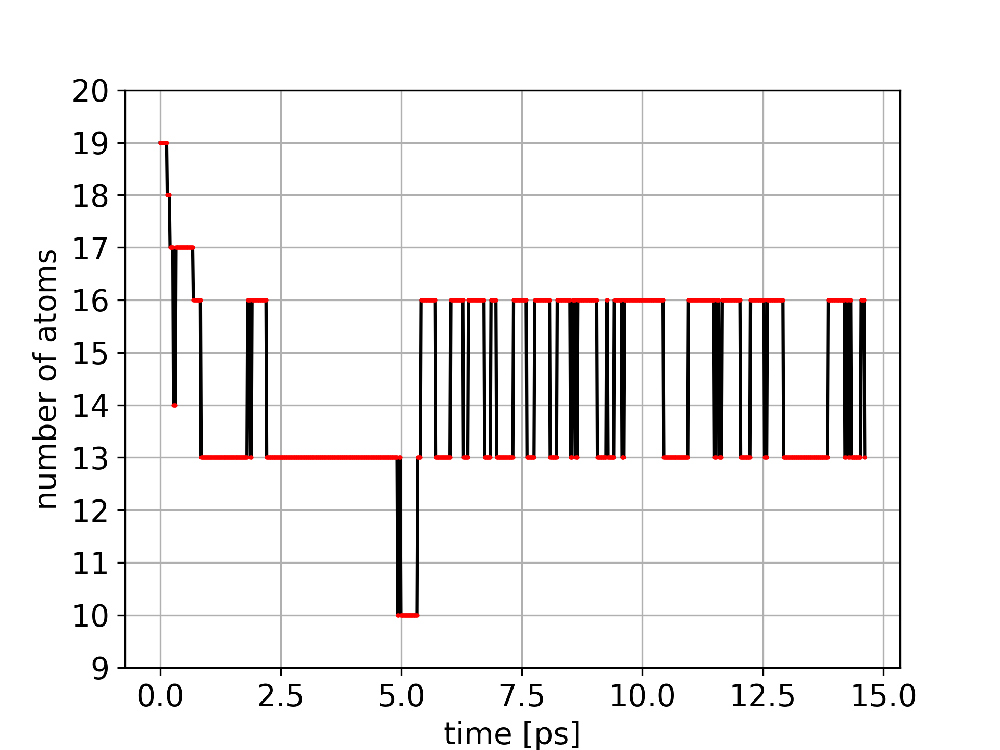
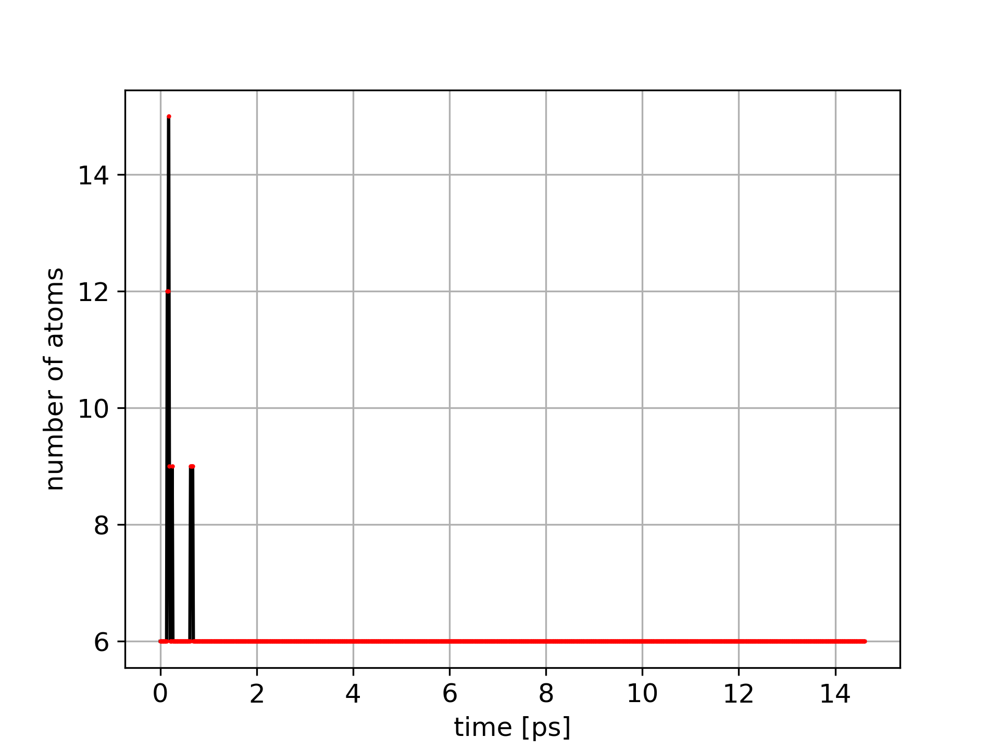
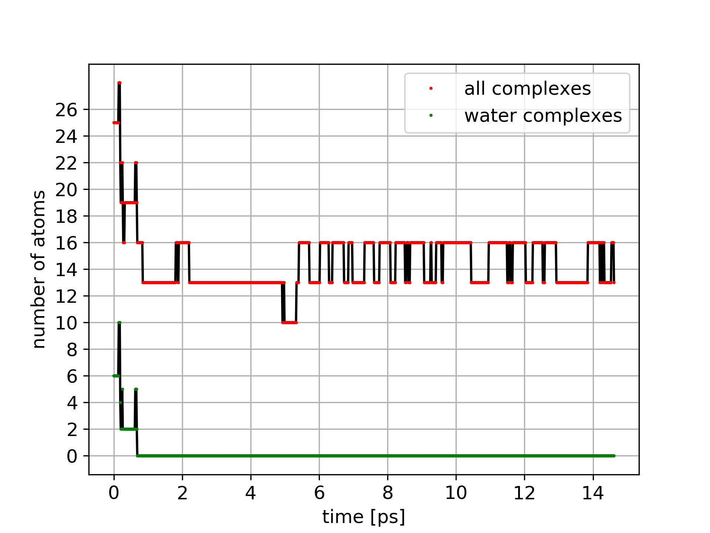
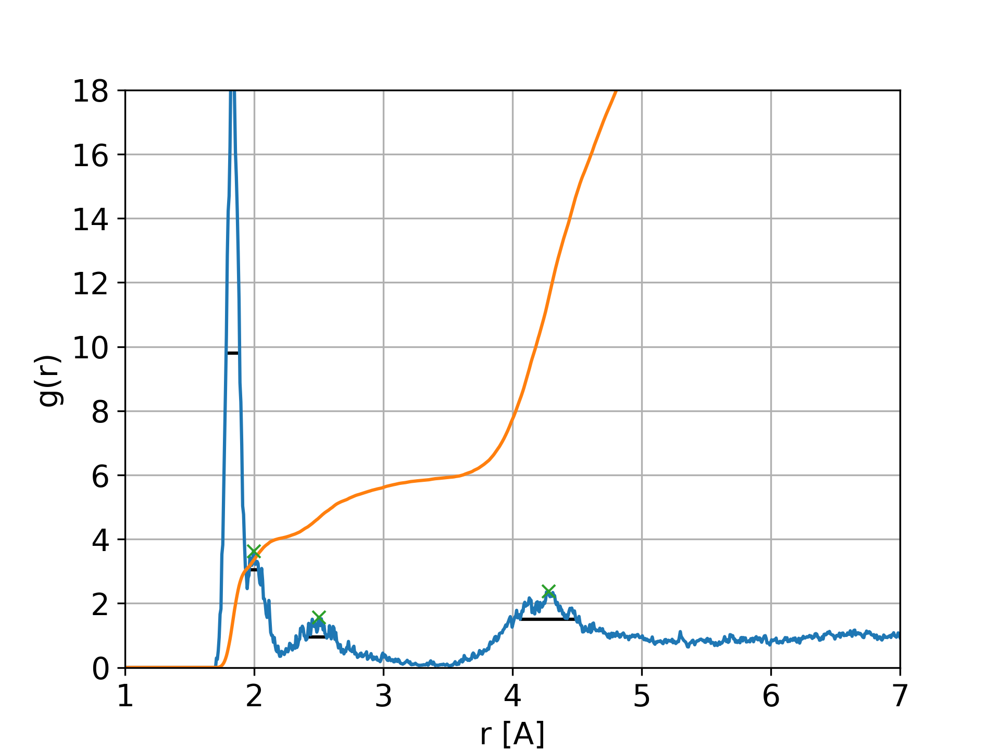
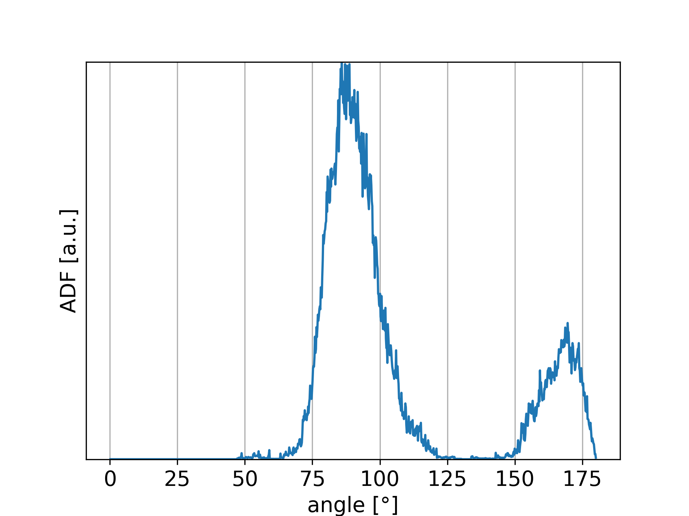
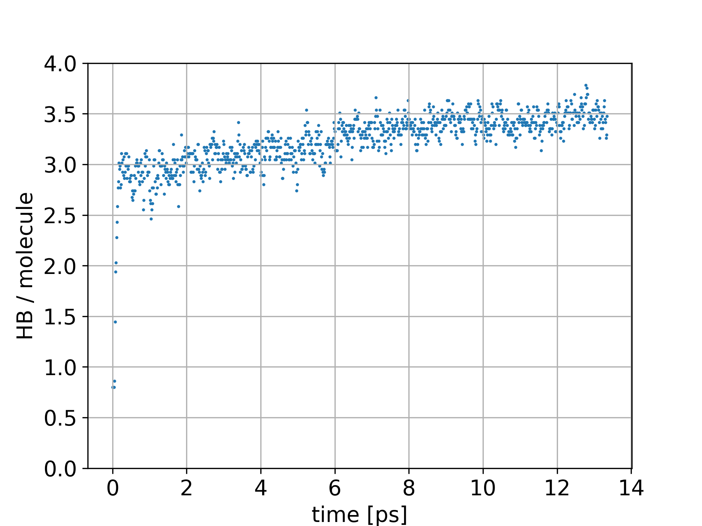

.. _Output:

Output files
============

Explanation of the output files.

.. contents::
    :local:

Note that images produced with the LaTeX font output flag are saved in PDF format and deviates from the images below in terms of style and axis labels.

THE GIVEN EXAMPLES NEED A REWORK!
    
.. _Output_snap:
    
".snap"
-------
Contains all the atomic information extracted from the trajectory file.

File produced by function :func:`.tra_save` while running :ref:`Usage_paw_structure_fast` if **SAVE** is TRUE in :ref:`Control_TRA`.

The header contains general information like the time interval and number of snapshots that have been extracted, the number of atoms in each snapshot and the unit cell matrix.

.. _CP-PAW: https://www2.pt.tu-clausthal.de/paw/

Every snapshot contains the simulation time and iteration and for every atom the internal name, species identifier, index and atomic positions from the CP-PAW_ code.

Lines were replaced by "..." for better visibility of the structure.

.. literalinclude:: Images/mn.snap

.. _Output_ion:

".ion"
------
Contains all the atoms contained in an ion complex.

File produced by function :func:`.ion_save` while running :ref:`Usage_paw_structure_fast` if :ref:`Control_ION` block is active.

The header contains general information like the time interval and number of snapshots that have been extracted, the unit cell matrix and the parameter selected in the control file.

Every snapshot contains the simulation time, iteration and number of atoms in the complex. For those atoms the internal name, species identifier, index and atomic positions from the CP-PAW_ code are listed.

Lines were replaced by "..." for better visibility of the structure.

.. literalinclude:: Images/mn.ion

.. _Output_water:

".water"
--------
Contains all the atoms contained in water complexes.

File produced by function :func:`.water_save` while running :ref:`Usage_paw_structure_fast` if :ref:`Control_WATER` block is active.

The header contains general information like the time interval and number of snapshots that have been extracted, the unit cell matrix and the parameter selected in the control file.

Every snapshot contains the simulation time, iteration and number of atoms in the complex. For those atoms the internal name, species identifier, index and atomic positions from the CP-PAW_ code are listed.

Lines were replaced by "..." for better visibility of the structure.

.. literalinclude:: Images/mn.water
    
.. _Output_radial:

".radial"
---------
Contains values for radial distribution function and coordination number.

File produced by function :func:`.radial_save` while running :ref:`Usage_paw_structure_fast` if :ref:`Control_RADIAL` block is active.

The header contains general information like the time interval and number of snapshots that have been extracted, the unit cell matrix and the parameter selected in the control file.

Additionally there is the average atom density **RHO** of the species **ID2**.

The column **RDF** contains the values for the radial distribution function and **COORDINATION** for the coordination number corresponding to the radii in column **RADIUS**.

Lines were replaced by "..." for better visibility of the structure.

.. literalinclude:: Images/mn.radial

.. _Output_angle:

".angle"
---------
Contains values for angular distribution function.

File produced by function :func:`.angle_save` while running :ref:`Usage_paw_structure_fast` if :ref:`Control_ANGLE` block is active.

The header contains general information like the time interval and number of snapshots that have been extracted, the unit cell matrix and the parameter selected in the control file.

The column **ADF** contains the values for the angular distribution function corresponding to the degree values in column **RADIUS**.

Lines were replaced by "..." for better visibility of the structure.

.. literalinclude:: Images/mn.angle
    
.. _Output_hbonds_c:

".hbonds\_c"
------------
Contains values for the hydrogen bonds per molecule for the different snapshots.

File produced by function :func:`.hbonds_save_c` while running :ref:`Usage_paw_structure_fast` if :ref:`Control_HBONDS` block is active.

The header contains general information like the time interval and number of snapshots that have been extracted, the unit cell matrix and the parameter selected in the control file.

The column **TIME** contains the simulation time of each snapshot in ps.

Lines were replaced by "..." for better visibility of the structure.

.. literalinclude:: Images/mn.hbonds_c

.. _Output_ion_out:

".ion\_out"
-----------
Contains all the atoms contained in an ion complex for snapshots where the composition of atoms changes.

File produced by function :func:`.ion_save` while running :ref:`Usage_paw_structure_ion`.

The header contains general information like the time interval in which changes occur, the number of these snapshots and the unit cell matrix. The parameter selected in the control file like :data:`ID1` or :data:`CUT1` can be found in the :ref:`Output_ion` file which is the origin for the data in this file.

Every snapshot contains the simulation time, iteration and number of atoms in the complex. For those atoms the internal name, species identifier, index and atomic positions from the CP-PAW_ code are listed.

Lines were replaced by "..." for better visibility of the structure.

.. literalinclude:: Images/mn.ion_out

.. _Output_water_out:

".water\_out"
-------------
Contains all the atoms contained in water complexes for snapshots where the composition of atoms changes.

File produced by function :func:`water_save` while running :ref:`Usage_paw_structure_water`.

The header contains general information like the time interval in which changes occur, the number of these snapshots and the unit cell matrix. The parameter selected in the control file like :data:`ID1` or :data:`CUT` can be found in the :ref:`Output_water` file which is the origin for the data in this file.

Every snapshot contains the simulation time, iteration and number of atoms in the complexes. For those atoms the internal name, species identifier, index and atomic positions from the CP-PAW_ code are listed.

Lines were replaced by "..." for better visibility of the structure.

.. literalinclude:: Images/mn.water_out

.. _Output_water_ion:

".water\_ion"
-------------
Contains all the atoms contained in ion and water complexes combined into one file.

File produced by function :func:`ion_save` while running :ref:`Usage_paw_structure_water` if a :ref:`Output_ion` file is provided.

The header contains general information like the time interval in which changes occur, the number of these snapshots and the unit cell matrix. The parameter selected in the control file like :data:`ID1` or :data:`CUT` can be found in the :ref:`Output_water` and :ref:`Output_ion` files which are the origin for the data in this file.

Every snapshot contains the simulation time, iteration and number of atoms in the complexes. For those atoms the internal name, species identifier, index and atomic positions from the CP-PAW_ code are listed.

Lines were replaced by "..." for better visibility of the structure.

.. literalinclude:: Images/mn.water_ion

.. _Output_ion_png:

"_ion.png"
----------
Plot of the number of atoms contained in the ion complex detected while running :ref:`Usage_paw_structure_fast`. It is produced while running :ref:`Usage_paw_structure_ion`.

In red are actual data points and black are straight lines connecting these. This becomes relevant with a worse time resolution so the user can still identify which are actual results.

Careful interpretation by the user is necessary to understand the results. A sudden change by three atoms for example can be due to an oxygen molecule leaving the cutoff distance of the  :ref:`detection algorithm <CONTROL_ION_algorithm>` and therefore, the hydrogen atoms close to it are also not counted anymore.

    Plot produced while running :ref:`Usage_paw_structure_ion`.
    
.. Note::

    PDF file is produced when using flag **-l**. See :ref:`Usage_paw_structure_ion` for more details.

.. _Output_water_png:

"_water.png"
------------
Plot of the number of atoms contained in the water complexes detected while running :ref:`Usage_paw_structure_fast`. It is produced while running :ref:`Usage_paw_structure_water`.

The graph changes depending on if an ion complex is given as well (see figures below).

In red or green are actual data points and black are straight lines connecting these. This becomes relevant with a worse time resolution so the user can still identify which are actual results.

Careful interpretation by the user is necessary to understand the results. A sudden change by three atoms in water complexes for example can be due to a hydronium ion transitioning into a Zundel ion increasing the number of atoms in complexes by a water molecule.

    Plot produced while running :ref:`Usage_paw_structure_water` without ion complex.
    

    Plot produced while running :ref:`Usage_paw_structure_water` with ion complex.
    
.. Note::

    PDF file is produced when using flag **-l**. See :ref:`Usage_paw_structure_water` for more details.

.. _Output_radial_png:

"_radial.png"
-------------
Plot of the radial distribution function (RDF) saved in the :ref:`Output_radial` while running :ref:`Usage_paw_structure_fast`. It is produced by :ref:`Usage_paw_structure_radial`.

The graph changes depending on what features are selected. The figure below shows all available options chosen.

In blue is the RDF and orange is the coordination number which results from the RDF integration. Additionally, peaks can automatically be detected and are marked with green crosses. The FWHM of these peaks is shown in black.

    
    Plot produced while running :ref:`Usage_paw_structure_radial`.
    **blue**: RDF, **orange**: coordination number, **green**: detected peaks, **black**: FWHM
    
.. Note::

    PDF file is produced when using flag **-l**. See :ref:`Usage_paw_structure_radial` for more details.
    
    When selected, multiple data sets can appear in one graph.
    
.. _Output_angle_png:

"_angle.png"
-------------
Plot of the angular distribution function (ADF) saved in the :ref:`Output_angle` while running :ref:`Usage_paw_structure_fast`. It is produced by :ref:`Usage_paw_structure_angle`.

.. Todo::

    Include peak detection.

    
    Plot produced while running :ref:`Usage_paw_structure_angle`.
    Angular distribution function of Mn-O.
    
.. Note::

    PDF file is produced when using flag **-l**. See :ref:`Usage_paw_structure_angle` for more details.
    
    When selected, multiple data sets can appear in one graph.

.. _Output_hbonds_png:

"_hbonds.png"
-------------
Plot of the average hydrogen bond number per molecule as a function of time produced by :ref:`Usage_paw_structure_radial`. The data comes from the :ref:`Output_hbonds_c` file which is created while running :ref:`Usage_paw_structure_fast`.

    
    Plot produced by running :ref:`Usage_paw_structure_hbonds`. 
    Hydrogen bond per molecule as a function of time.
    
.. Note::

    PDF file is produced when using flag **-l**. See :ref:`Usage_paw_structure_hbonds` for more details.
    
    When selected, multiple data sets can appear in one graph.

.. _Output_gap_png:

"_gap.png"
----------
XXX INCLUDE FILE XXX
