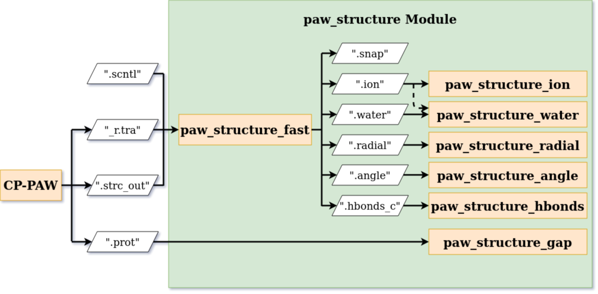

.. _Usage:

Usage
=====

.. _CP-PAW: https://www2.pt.tu-clausthal.de/paw/

The :ref:`workflow<Usage_workflow>` in combination with the CP-PAW_ simulations code can be separated into two stages which are data extraction and presentation. The program paw\_structure\_fast takes CP-PAW_ output as a source of data and depending on the user created :ref:`CONTROL` it extracts certain information. These are then saves into several output files and are accessible to the user. However, they are not designed to give a good overview. Using the other programs in the package the user can generate additional output files and graphs to make the aspects of the analysis more visible and accessible. 

The usage of the paw\_structure package is based on the command line executables::
    
    paw_structure_fast
    paw_structure_ion
    paw_structure_water
    paw_structure_radial
    paw_structure_angle
    paw_structure_hbonds
    paw_structure_gap
    
.. _Usage_workflow:
    

    Workflow in combination with CP-PAW_.

.. _Usage_paw_structure_fast:

paw\_structure\_fast
--------------------
Reads, extracts and analyses atomic information from the "_r.tra" trajectory file produced during the CP-PAW_ simulation. This process is controlled by the :ref:`control file ".scntl" <Control>`.

The routine is started inside the directory containing the input data with::

    paw_structure_fast <root>.scntl
    
This executes the module :mod:`.structure_fast` internally.

Several output files containing the raw data results from the analysis are created. For a detailed description of each see section :ref:`Output`.

A description of the algorithms used can be found underneath their corresponding control block in section :ref:`Control`.

Possible output files are

.. hlist::
    :columns: 3

    - :ref:`Output_snap`
    - :ref:`Output_ion` 
    - :ref:`Output_water`
    - :ref:`Output_radial`
    - :ref:`Output_hbonds_c`
    
.. _Usage_paw_structure_ion:
    
paw\_structure\_ion
-------------------
Performs further analysis of the data extracted by :ref:`Usage_paw_structure_fast` which is saved in the :ref:`Output_ion` file.

The routine is started inside the directory containing the input data with::

    paw_structure_ion [-p] [-l width fraction] [-x xmin xmax] [-y ymin ymax] ion
    
**mandatory**  

:ion: path of :ref:`Output_ion` complex file produced by :ref:`Usage_paw_structure_fast`

**optional**

:-p: show interactive graph of atom number in ion complex
:-l [width fraction]: PDF output in LaTeX font, width of document in pts and fraction of this width; defaults given for beamer and thesis
:-x [xmin xmax]: select range for x axis of plot
:-y [ymin ymax]: select range for y axis of plot
    
This executes the module :mod:`.structure_ion` internally.
    
The number of atoms as a function of time is plotted and saved into the :ref:`Output_ion_png` file. It detects changes in the atom composition of the ion cluster and saves snapshots where these changes occur into a seperate :ref:`Output_ion_out` file.

Output files are

.. hlist::
    :columns: 2
    
    - :ref:`Output_ion_out`
    - :ref:`Output_ion_png`
    
.. _Usage_paw_structure_water:

paw\_structure\_water
---------------------
Performs further analysis of the data extracted by :ref:`Usage_paw_structure_fast` which is saved in the :ref:`Output_water` file.

The routine is started inside the directory containing the input data with::

    paw_structure_water [-i ion] [-p] [-l width fraction] [-x xmin xmax] [-y ymin ymax] [-k] water
    
**mandatory**  

:water: path of :ref:`Output_water` complex file produced by :ref:`Usage_paw_structure_fast`

**optional**

:-i [ION]: path of :ref:`Output_ion` complex file produced by :ref:`Usage_paw_structure_fast`
:-p: show interactive graph of atom number in water complexes
:-l [width fraction]: PDF output in LaTeX font, width of document in pts and fraction of this width; defaults given for beamer and thesis
:-x [xmin xmax]: select range for x axis of plot
:-y [ymin ymax]: select range for y axis of plot
:-k: plot key/legend in the graph; only works if ion is selected
    
This executes the module :mod:`.structure_water` internally.

The optional flag **-i** allows the consideration of an :ref:`Output_ion` file while analysing unusual water structures. This is to ensure that the water complexes are not part of an ion cluster. 

The number of atoms as a function of time is plotted and saved to a file. If no ion complex is present the total number of atoms in water complexes is plotted. If an ion complex is present, both the total number of atoms in any complex and the number of atoms only in water complexes is plotted.

It detects changes in the atom composition inside the :ref:`Output_water` file and saves snapshots where these changes occur into a seperate :ref:`Output_water_out` file.

If an ion complex is present, all atoms in this complex and the water complexes are combined and written into a :ref:`Output_water_ion` file.

Output files are

.. hlist::
    :columns: 3
    
    - :ref:`Output_water_out`
    - :ref:`Output_water_png`
    - :ref:`Output_water_ion`

.. Todo::
    
    Clean files of eventual ion complex contributions before change detection happens.

    Change detection in :ref:`Output_water_ion` file as well.
    
.. _Usage_paw_structure_radial:
    
paw\_structure\_radial
----------------------
Plotting of the radial distribution function (RDF) extracted by :ref:`Usage_paw_structure_fast` which is saved in the :ref:`Output_radial` file.

The routine is started inside the directory containing the input data with::

    paw_structure_radial [-i] [-fwhm] [-p] [-l width fraction] [-x xmin xmax] [-y ymin ymax] [-k] radial
    
**mandatory**  

:radial: paths of (multiple) :ref:`Output_radial` files produced by :ref:`Usage_paw_structure_fast`

**optional**

:-i: integrate RDF to obtain the coordination number
:-fwhm: peak detection and analysis
:-p: show interactive graph of radial distribution function
:-l [width fraction]: PDF output in LaTeX font, width of document in pts and fraction of this width; defaults given for beamer and thesis
:-x [xmin xmax]: select range for x axis of plot
:-y [ymin ymax]: select range for y axis of plot
:-k: plot key/legend in the graph (label is file name compiled in LaTeX)
    
This exectures the module :mod:`.structure_radial` internally.

The mathematical description and definitions can be found in the :ref:`Control_RADIAL` control block.

The peak detection is performed using :func:`.radial_peak` utilizing :py:mod:`scipy` routines.

Output files are

.. hlist::
    :columns: 1
    
    - :ref:`Output_radial_png`
    
.. Todo::

    Additional output of peak detection into file. At the moment only printed into console.
    
.. _Usage_paw_structure_angle:
    
paw\_structure\_angle
----------------------
Plotting of the angular distribution function (ADF) extracted by :ref:`Usage_paw_structure_fast` which is saved in the :ref:`Output_angle` file.

The routine is started inside the directory containing the input data with::

    paw_structure_angle [-fwhm] [-sin] [-p] [-l width fraction] [-x xmin xmax] [-y ymin ymax] [-k] angle
    
**mandatory**  

:angle: paths of (mulitple) :ref:`Output_angle` files produced by :ref:`Usage_paw_structure_fast`

**optional**

:-fwhm: peak detection and analysis
:-sin: multiply angle distribution with :math:`\sin (\theta)` and normalize
:-p: show interactive graph of angular distribution function
:-l [width fraction]: PDF output in LaTeX font, width of document in pts and fraction of this width; defaults given for beamer and thesis
:-x [xmin xmax]: select range for x axis of plot
:-y [ymin ymax]: select range for y axis of plot
:-k: plot key/legend in the graph (label is file name compiled in LaTeX)
    
This exectures the module :mod:`.structure_angle` internally.

The peak detection is performed using :func:`.radial_peak` utilizing :py:mod:`scipy` routines.

Output files are

.. hlist::
    :columns: 1
    
    - :ref:`Output_angle_png`
    
.. Todo::

    Additional output of peak detection into file. At the moment only printed into console.
    
    Peak detection does not work properly yet.
    
.. _Usage_paw_structure_hbonds:

paw\_structure\_hbonds
----------------------
Plotting of the average hydrogen bond number per oxygen atom as a function of time. Data is extracted by :ref:`Usage_paw_structure_fast` and is saved in the :ref:`Output_hbonds_c` file.

The routine is started inside the directory containing the input data with::

    paw_structure_hbonds [-p] [-avg points] [-l width fraction] [-x xmin xmax] [-y ymin ymax] [-k] hbonds
    
**mandatory**  

:hbonds: paths of (mulitple) :ref:`Output_hbonds_c` files produced by :ref:`Usage_paw_structure_fast`

**optional**

:-p: show interactive graph of hydrogen bond number
:-avg [points]: plot running average over selected number of data points
:-l [width fraction]: PDF output in LaTeX font, width of document in pts and fraction of this width; defaults given for beamer and thesis
:-x [xmin xmax]: select range for x axis of plot
:-y [ymin ymax]: select range for y axis of plot
:-k: plot key/legend in the graph (label is file name compiled in LaTeX)
    
This exectures the module :mod:`.structure_hbonds` internally.

.. _Usage_paw_structure_gap:

paw\_structure\_gap
-------------------
Plotting of the energy gap and the HOMO/LUMO energy taken from the CP-PAW protocol file ".prot".

The routine is started inside the directory containing the input data with::

    paw_structure_gap [-p] [-l width fraction] [-x xmin xmax] [-y1 ymin1 ymax1] [-y2 ymin2 ymax2] prot
    
**mandatory**

:prot: path of ".prot" file produced by CP-PAW code

**optional**

:-p: show interactive graph of the energies
:-l [width fraction]: PDF output in LaTeX font, width of document in pts and fraction of this width; defaults given for beamer and thesis
:-x xmin xmax: select range for x axis of plot
:-y1 ymin1 ymax1: select range for y1 axis of plot (energy gap)
:-y2 ymin2 ymax2: select range for y2 axis of plot (HOMO/LUMO energy)

This executes the module :mod:`.structure_gap` internally.

The three different energies are plotted as a function of simulation time with HOMO/LUMO energies sharing a y axis.

Output files are

.. hlist::
    :columns: 1
    
    - :ref:`Output_gap_png`

.. Todo::

    Implement removal of doubled simulation times similar to :func:`.tra_clean`.
    
    Implement check if energy gap is even present in protocol file (variable occupations).
